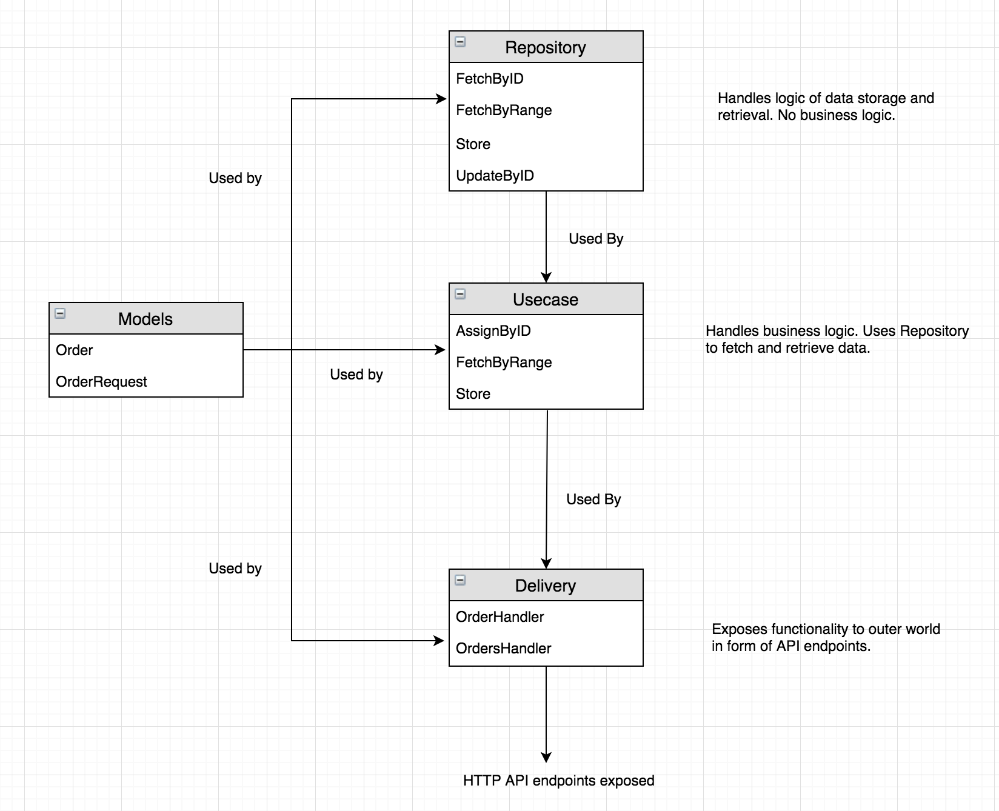

Order Service
====================

Specifications
----

This repository contains a service which simulates real life scenario of order placement and assignment in 
real life delivery services. The APIs are written using Go and MongoDB is used as the database.

#### Endpoint 1 POST "http://localhost:8080/orders"
- API endpoint for creation of orders
- Uses google maps Go client library to calculate distance.
- Returns error if request body is not correct or if distance is not calculated correctly.

#### Endpoint 2 GET "http://localhost:8080/orders"
- Provides access to all available orders
- Uses paging. Sample : "http://localhost:8080/orders?page=10&limit=5"
- By default, uses values page=1 limit=10. Hence "http://localhost:8080/orders" returns first ten records.
- Page size is 10 by default but can be set in Dockerfile.
- If limit value provided is greater than the page size, length of orders returned is page size.

#### Endpoint 3 PATCH "http://localhost:8080/orders/:id"
- Changes the status of order from UNASSIGNED to TAKEN
- Only 1 way change is allowed, an order once TAKEN cannot be UNASSIGNED
- Returns error if already assigned order is requested to be assigned again.
- Returns error if order not found or id is invalid.

Architecture/ Code structure
----

The code structure for the project has it's motivation in Uncle Bob's Clean Architecture.

#### It tries to follow the following principles
- Independence from Frameworks - The architecture does not depend on the existence of some library. Databases/UI frameworks can be swapped easily. Business logic is independent of DB or style of exposure.
- Separation of concerns - Layers of architecture should be such that business concerns, delivery concerns and storage concerns are not intermixed.
- Individual Testable components - The business logic, http delivery logic can be tested separately.

#### 4 layered architecture
- Models - Stores the structures of data. Can be utilized in any layer.
- Repository - This layer is responsible for CRUD operations, whether from DB or another service. No business logic.
- Usecase - This layer will act as the business process handler. It decides and uses Repository layer accordingly.
- Delivery - This acts as the presenter to the outer world. Contacts Usecase layer to respond to API calls.

Details
----

#### Unit tests and code coverage
- Unit tests have been written for usecase and http packages with 93% and 85% coverage respectively.

#### Steps to run
- Clone this repo
- Update values of environment variables in Dockerfile.
- sh start.sh

#### Steps to stop
- sh stop.sh
